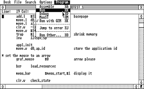

# pt_src3.s aka Lance player

## 1993-08-22, Göteborg

In my small university dorm room I completed pt_src3.s right before I was about to start my university studies at Chalmers.

pt_src3.s was the amalgam of all the best ideas I had seen for Paula emulators for Atari STE.

At the time of the release I felt the Atari STE was definitely fading away in favour of the PC. I thought pt_src3.s was a good paula emulator across several metrics but because of the disappearance of the Atari scene it would never see. I uploaded the pt_src3.s to ftp.sunet.se and ftp.funet.fi and turned off my Atari STE.

## Summer 2000, Göteborg

I was now working as a junior software engineer for a company doing map engine and other consultancy work. I had forgotten about my Atari STE and pt_src3.s.

I was therefore very surprised when I was contacted over email by [Leonard](https://demozoo.org/sceners/2527/) asking my about pt_src3.s and if I could do something about the excessive memory usage of it for a demo he was creating.

We exchanged a few emails back and forth but basically came to the conclusion that speed of pt_src3.s came from lots of self-generated code and that making it 25kHz would be rather difficult and not reclaim that much memory.

He had some ideas on how to address the problem and I didn't hear much more.

I was later blown away about what he used it for when I saw [STNICCC 2000 Demo](https://demozoo.org/productions/59549/)([Youtube](https://www.youtube.com/watch?v=nqVJWFNpTqA&t=20s)).

A life-time achievment unlocked for me although I consider the Paula emulator a very small part of that demo.

I read [Leonards blog](http://leonard.oxg.free.fr/) and found the story about breaking an [old sprite record](http://leonard.oxg.free.fr/record16/record16.html) fascinating and it reminded me about my efforts that lead to pt_src3.s. I thought that I perhaps should write the pt_src3.s story.

This is my 10th attempt of writing that story.

## First steps

The first time I saw a computer (Commodore 64) I was hooked. I was drawn to computers instinctively.

I almost exclusively played games but tinkered in basic programming but I didn't understand much. I was greatly disappointed after pain stakingly typing in a bubble sort routine and there was no bubbles to be seen on screen.

My mind was blown by the peek/poke listings so common in computer magazines.

> How can anyone program this way? It makes no sense.

Eventually I inherited my father's Atari 260 (extended to 1 Meg of RAM) and the monochrome hi-res monitor, 640x400 71 hz and paper white.

I still mostly played games while tinkering with programming but didn't see much point in programming as I thought I could just buy the games I needed.

## Becoming a programmer

A very important turning point for me was a summer trip through Sweden with my family. We had a big american car which was odd in sweden and we went on a trip in it.

Before the trip my father had given me an advanced calculator that had a BASIC interpreter.

As there was no games on the calculator I was learning BASIC while sitting in the back of the car during the summer trip and programmed a slot machine game, guess the number and a very simple shoot-em-up.

What I learnt was that I enjoyed programming and when I returned home I started doing [GFA Basic](https://en.wikipedia.org/wiki/GFA_BASIC) for fun.

## The Cuddly Demos around 1990

As I was interested in games and graphics after awhile I had moved on from [GFA Basic](https://en.wikipedia.org/wiki/GFA_BASIC) to [STOS BASIC](https://en.wikipedia.org/wiki/STOS_BASIC) which was a basic version intended to write games and graphics in.

However when a friend showed me [The Cuddly Demos by The Carebears](https://demozoo.org/productions/76257/)([youtube](https://www.youtube.com/watch?v=5pRelt_CPVk)) my mind was blown. I thought:

> I can never make this in STOS. I need to learn assembler!

I know now that people have done amazing thing in STOS, maybe even on the level of The Cuddly Demos but this is what got me into assembler programming.

## Dev Pac, I loved you

Lot of great Atari Software came through germany and somehow I got hold of a german version of [DevPac from HiSoft Systems](https://en.wikipedia.org/wiki/HiSoft_Systems). Which assembler is the best is subjective but I loved Dev Pac and the debugger.

