# pt_src3.s aka Lance player

## 1993-08-22, Göteborg


> Chalmers, where I studied 1993-1998. It was a very positive period for me.

In my small university dorm room I completed pt_src3.s right before I was about to start my university studies at Chalmers.

pt_src3.s was the amalgam of all the best ideas I had seen for Paula emulators for Atari STe.

At the time of the release I felt the Atari STe was definitely fading away in favour of the PC. I thought pt_src3.s was a good paula emulator across several metrics but because of the disappearance of the Atari scene it would never see. I uploaded the pt_src3.s to ftp.sunet.se and ftp.funet.fi and turned off my Atari STe.


> Atari 1040STF, very similar look to the somewhat improved Atari 1040STe I had.

## Summer 2000, Göteborg

I was now working as a junior software engineer for a company doing map engine and other consultancy work. I had forgotten about my Atari STe and pt_src3.s.

I was therefore very surprised when I was contacted over email by [Leonard](https://demozoo.org/sceners/2527/) asking my about pt_src3.s and if I could do something about the excessive memory usage of it for a demo he was creating.

We exchanged a few emails back and forth but basically came to the conclusion that speed of pt_src3.s came from lots of self-generated code and that making it 25kHz would be rather difficult and not reclaim that much memory.

He had some ideas on how to address the problem and I didn't hear much more.

I was later blown away about what he used it for when I saw [STNICCC 2000 Demo](https://demozoo.org/productions/59549/)([Youtube](https://www.youtube.com/watch?v=nqVJWFNpTqA&t=20s)).


> Screen from STNICC 2000.

A life-time achievement unlocked for me although I consider the Paula emulator a very small part of that demo.

I read [Leonards blog](http://leonard.oxg.free.fr/) and found the story about breaking an [old sprite record](http://leonard.oxg.free.fr/record16/record16.html) fascinating and it reminded me about my efforts that lead to pt_src3.s. I thought that I perhaps should write the pt_src3.s story.

This is my 10th attempt at writing that story.

## First steps

The first time I saw a computer (Commodore 64) I was hooked. I was drawn to computers instinctively.


> A friend of mine had a Commodore 64 very much like this.

I almost exclusively played games but tinkered in basic programming but I didn't understand much. I was greatly disappointed after pain stakingly typing in a bubble sort routine and there was no bubbles to be seen on screen.

My mind was blown by the peek/poke listings so common in computer magazines.

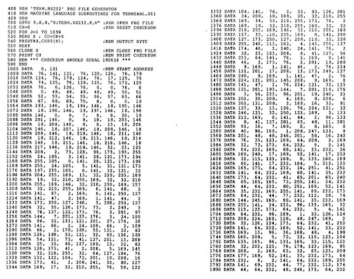
> I was stunned: How can anyone program this way? It makes no sense.

Eventually I inherited my father's Atari 260 (extended to 1 Meg of RAM) and the monochrome hi-res monitor, 640x400 71 hz and paper white.


> The computer in the picture is an Atari 520 ST but the Atari 260 ST looked exactly like that except for a different model number. The Atari in the picture also has a german layout, just like my 260 ST.

I still mostly played games while tinkering with programming but didn't see much point in programming as I thought I could just buy the games I needed.

## Becoming a programmer

A very important turning point for me was a summer trip through Sweden with my family. We had a big american car which was a rare car in sweden and we went on a road trip over the summer.

Before the trip my father had given me an advanced calculator that had a BASIC interpreter.

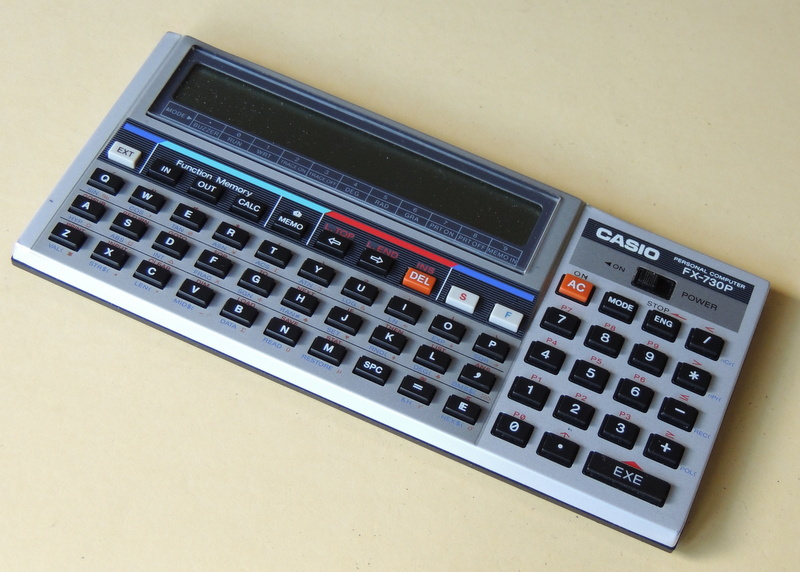
> The Casio FX730P came with a BASIC interpreter and nothing else so I had to learn BASIC to make games.

As there were no games on the calculator I was learning BASIC while sitting in the back of the car during the summer trip and programmed a slot machine game, guess the number and a very simple shoot-em-up.

What I learnt was that I enjoyed programming and when I returned home I started doing [GFA Basic](https://en.wikipedia.org/wiki/GFA_BASIC) for fun.

## The Cuddly Demos around 1990

As I was interested in games and graphics after awhile I had moved on from [GFA Basic](https://en.wikipedia.org/wiki/GFA_BASIC) to [STOS BASIC](https://en.wikipedia.org/wiki/STOS_BASIC) which was a basic version intended to write games and graphics in.


> STOS BASIC loading screen

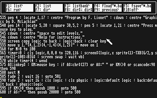
> STOS BASIC editor, IIRC you could draw graphics using direct commands that allowed for experimentation

However when a friend showed me [The Cuddly Demos by The Carebears](https://demozoo.org/productions/76257/)([youtube](https://www.youtube.com/watch?v=5pRelt_CPVk)) my mind was blown. I thought:

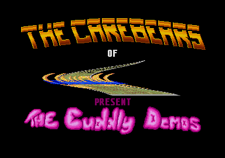
> "I can never make this in STOS. I need to learn assembler!"

I know now that people have done amazing thing in STOS, maybe even on the level of The Cuddly Demos but this is what got me into assembler programming.

## Dev Pac, I loved you

Lot of great Atari Software came through Germany and somehow I got hold of a German version of [DevPac from HiSoft Systems](https://en.wikipedia.org/wiki/HiSoft_Systems). Which assembler is the best is subjective but I loved Dev Pac and the debugger.

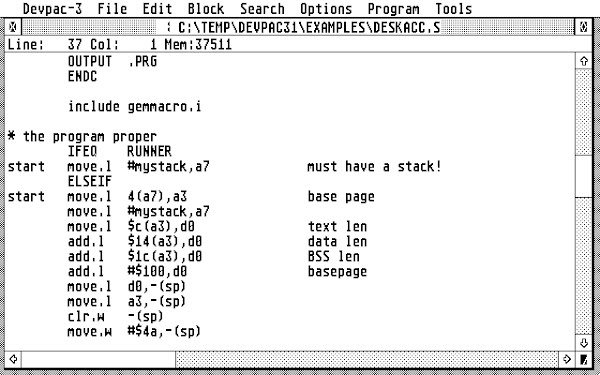
> DevPac source code editor, I remember it as awesome.

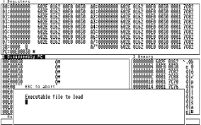
> DevPac debugger, I still remember some keyboard commands such as setting break points and running.

I learnt the basics of assembler programming from [Svenska Hemdatornytt](https://sv.wikipedia.org/wiki/Svenska_Hemdatornytt)(Swedish home computer news) and their series "Learn assembler programming".


Hemdatornytt had a comic called [Atari STen](http://hemdatornytt2.selda.se/atari-sten-arkiv/) (swedish pun) made by a young [Johan Wanloo](https://en.wikipedia.org/wiki/Johan_Wanloo)


> "Remember kids, do your homework, eat your spinach, be kind and teach yourself assembler programming" - Atari STen


I still remember the intense feeling when I got my first scroll text working.

## Atari STe around 1991

The Atari 260 ST was ageing, it had a few technical problems and I read about the new Atari STe which among other things had support for digital to audio signal conversion. This was possible on the old Atari ST but had to be emulated which took precious clock cycles.

My father got me a summer job on an oil tanker which itself was pretty cool but the important outcome was that I earned a bit of money and could purchase an Atari STe.

To help me unlock the power of the STe I had the book "Atari ST/STe - Hårdfakta" that had been updated to contain information about the STe specific hardware.

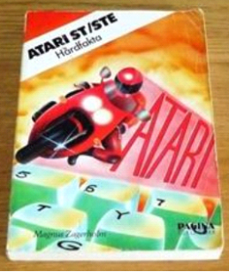
> My copy of Hårdfakta was falling apart from constant flicking through the pages

## TCB Tracker

The Carebears, which I idolised due to The Cuddle Demos, released their own tracker called TCB Tracker. Trackers were a software common on the Amiga to make cool music.

The TCB Tracker was rumoured to have an STe enhanced mode that utilized the Atari STe new digital to audio sound chip.

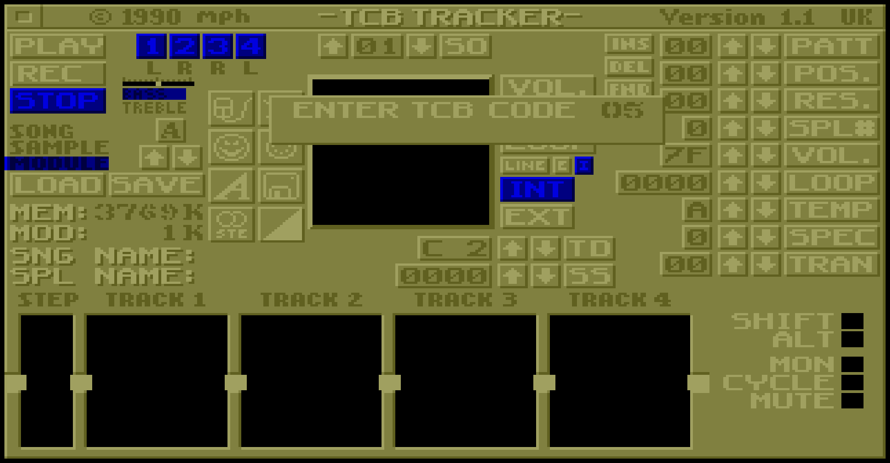
> TCB Tracker was a bit of a disappointment to me as I was hoping for great STe mode. On the other hand the lack of said mode spurred me to try to create my own.

I was however not impressed by the sound quality. The sound was more crisp in the Atari ST mode compared to the Atari STe mode.

Analysing the player code I found out why.

On the old Atari ST when you emulated a digital to analog sound chip you ran an interrupt on 10kHz as a compromise between quality and speed. Each interrupt the next 8 bit sample was read and using "magic" (as in I never understood how it worked) the sample was translated to instructions to the Atari ST square wave sound chip that emulated a digital to audio conversion. It did sound surprisingly good often.

On the new Atari STe there was however a dedicated DMA that automatically read 8 bit samples from memory into the sound chip for you.

The only difference between the Atari ST and Atari STe mode in the TCB Tracker player code was that instead of the interrupt writing to the Atari ST chip it wrote the samples to a 2 byte looped area that sent the samples to the STe sound chip at 12.5kHz. Essentially the same architecture which makes sense I suppose.

A very simple change to make the sound more crisp was to switch the frequency from 12.5kHz to 50kHz (the highest supported frequency by the Atari STe).

However, in my mind in order to fully utilise the Atari STe an entirely new architecture has to be created. I decided to write my own player.

## NoiseTracker and Dr. Doom

Most songs, also known as modules, were not created in TCB Tracker. They were created in SoundTracker, NoiseTracker or ProTracker on the Amiga.

In order to get access to the maximum amount of songs I wanted my player to be a NoiseTracker player.

But I needed some way to get me started.

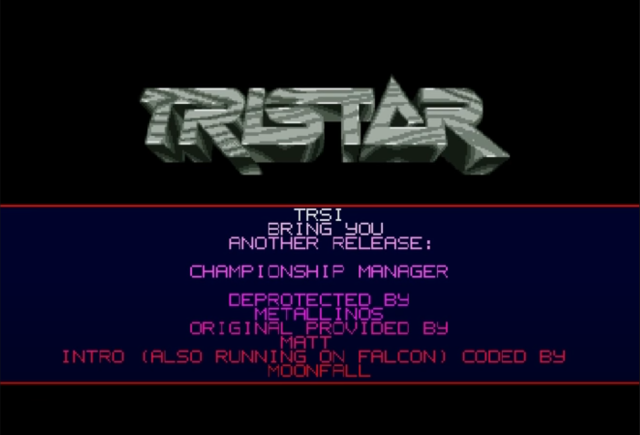
> A common cracktro at the time but unfortunately not the Dr. Doom one.

Games were typically protected in various ways to prevent piracy. These protections were removed and the games were released on "Compacted Disks" containing several games on a single floppy. This was called cracking a game and the people doing so often put a small "cracktro" with contact info, cool graphics and music before loading the game.

One of those was made by a Dr. Doom. I can't find an image of this cracktro but what was special about it was that it had a decent STe player.

Using a home-grown memory scanner I managed to find the decompressed code in memory, save it and reverse engineered it.

The Dr. Doom player worked as I thought it should. It played NoiseTracker songs and it was architectured around the STe hardware.

I used the Dr. Doom player as a basis for my own player and pt_src3.s is therefore ultimately a derivative of the Dr. Doom player.

## Amiga vs Atari STe

The Amiga had 4 independent digital to analog sound channels with pitch and volume control.

As much as we wanted the Atari STe to be an "Amiga killer" it didn't really deliver in that area as the Atari STe had 2 digital to analog sound channels with independent volume control and shared coarse pitch control. The replay frequency of the STe was 6kHz, 12.5kHZ, 25kHz and 50kHz.

50kHz replay frequency was significantly higher than the Amiga about max ~28kHz replay frequency but that was about it.

The NoiseTracker format is strongly coupled to the Amiga hardware as it has 4 independent channels and the values for pitch and volume can be copied into the Amiga hardware registers without modification (my memory is admittedly a bit vague here).

In order to play Amiga Noisetracker the approach I went for was emulating the Amiga sound chip Paula thus pt_src3.s is a Paula emulator.

That meant I could use the Amiga NoiseTracker or ProTracker source code with just minor modifications to make them write to my "software" registers rather than the Amiga hardware registers.

In order to emulate the Paula sound chip on Atari STe you had to implement:
1. Fine grained pitch control per channel
2. Volume control per channel
3. Mix 2 channels into 1

Atari STe left and right channel are interleaved bytes like so:

```
------------------------------------------------
| Left  | Right | Left  | Right | Left  | Right
------------------------------------------------
```

One of my early attemps that wrote the left and right channel separately looked something like below.

```asm
; a0-a1 - points to sample                (2 channels)
; d0-d1 - fixed point offset into sample  (2 channels)
;  Top 16 bits is the fraction
;  Bottom 16 bits is the integer
; d2-d3 - fixed point pitch step
; d7    - number of samples to write
; a2-a3 - points to volume table          (2 channels)
.loop
move.b    (a0,d0.w),d4    ; Get sample for first channel
move.b    (a1,d1.w),d5    ; Get sample for second channel
move.b    (a2,d4.b),d4    ; Do volume calculation, divided by 2 implictly
add.b     (a3,d5.b),d4    ; Do volume calculation, divided by 2 implictly
                          ; adds the two samples to mix them
move.b    d4,(a4)         ; Store the sample in the output buffer
addq.l    #2,a4           ; The left & right channel are interleaved on STe
                          ; Therefore add with two
swap      d0              ; Restore the fixed point number
swap      d1              ; Restore the fixed point number
add.l     d2,d0           ; Add stepping speed for first channel
add.l     d3,d1           ; Add stepping speed for second channel
swap      d0              ; Restore the sample offset
swap      d1              ; Restore the sample offset
dbf       d7,.loop        ; Loop until frame is complete
```

This is not the very first version of the emulator as in the first version I also checked for the end of the sample at every sample but one of the very earliest optimizations I learnt about was extending the samples in the mod file with enough bytes so the end check could be done at the end of the frame rather at each byte.

It was a very significant improvement but still the code above is slow.

My memory of 68k instructions timings is a bit rusty but I think the above code evaluates to about 124 cycles per sample written. To support 12.5kHz you need to write 25,000 bytes per second (1 byte per each channel) which is about 3,100,000 cycles which on an 8MHz Atari STe is about 39% CPU or 80% CPU for a 25 kHz.

25 kHz did sound pretty good but it took a significant amount of time.

## Impulse and the Brainless Institute Party - Going to my first demo party

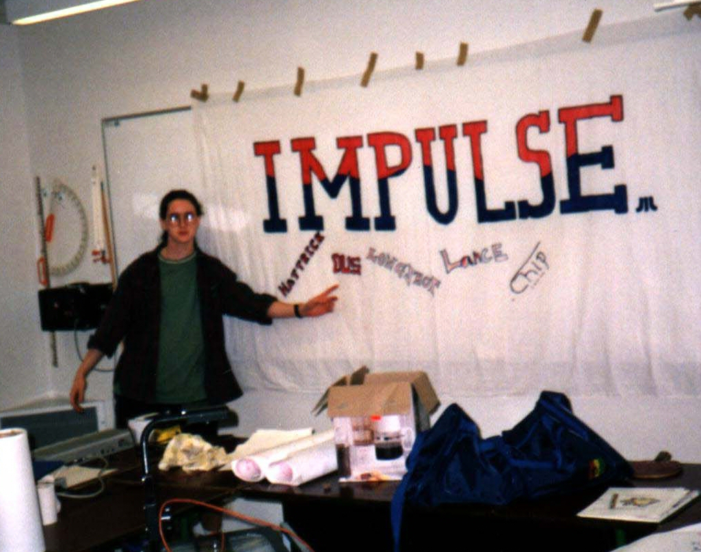
> Mandus (Glimglam) in front our Impulse logo

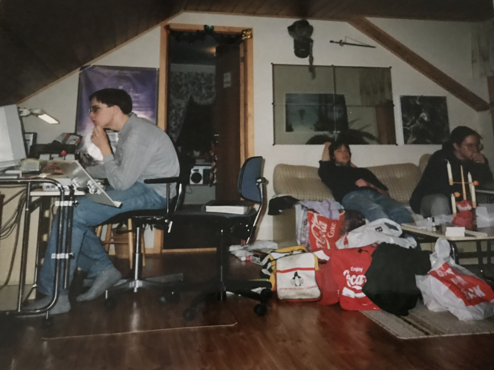
> From left to right, Mårten (Lance) probably optimizing some polygon filler, Johan (Jez), Mandus (Glimglam). Reine (Longshot) likely holding the camera

I had at this time started to hang around with the guys in [Impulse](https://demozoo.org/groups/29352/). We are not talking TCB, TLB or Omega level here, not even close but we had fun and we went to our first demo party in Skövde together.

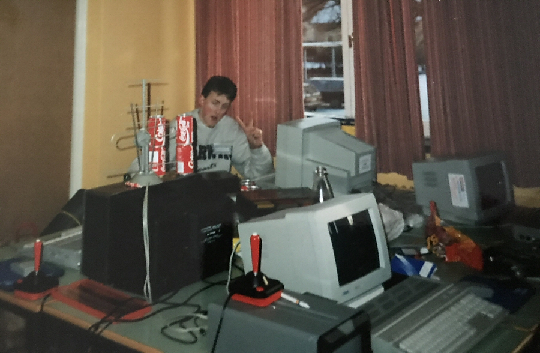
> Reine (Longshot) at Brainless Institute party 1992

Being quite the introvert the demo party was stressful but also quite exciting to see so many nerds with similar interest. Where I lived at the time computers were rare and there was little interest in them.

I brought my NoiseTracker routine and while at the demo party I chatted with one of the organisers that later used it in a party demo which was cool. He also showed me the first trick of removing the end checks per sample. Since 25kHz was very time consuming he used the 12kHz mode.

## The 50kHz barrier

As 25kHz was lower than the Amiga's max frequency there was a case for making a 50kHZ player. I had tinkered with the code but couldn't make it fast enough. After some failed attempts I had concluded it was impossible.

I was therefore very surprised when I saw Audio Sculpture which claimed to have a 50kHz mode.

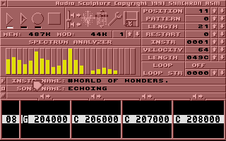
> Audio sculpture was the first tracker I saw that had the legendary 50kHz mode.

As many hackers I had already developed a bit of an unmotivated ego and seeing someone else achieve what I thought was impossible was a blow to that ego.

But it started a very important process in the brain. It is obviously possible to do 50kHz player. With that knowledge the brain starts looking for cheats and can find one that it previously didn't see.

I have felt that multiple times since then. "This can't be improved". Then someone shows an improvement and that in term leads to a new solution that is even better and so on.

A friendly competition can be very fruitful for everyone.

## Self-generating code and cheating

I managed to get a copy of the Audio Sculpture software and was experimenting with it. It did sound a lot like 50kHz so they had done it but I noticed that the pitch seemed to be fixed in steps. That did sound great for some songs but not all.

So what I suspected they did is that they used self-generating code to generate code to avoid pitch computation per sample but for memory reasons couldn't get the full pitch range of Amiga.

Here I believe I took a step in a direction most players didn't which later enabled pt_src3.s.

My thoughts were something like this.

With the base frequency of 50kHz if I am to play a sample at 29kHz I need to "stretch" 29000 bytes over 50000 bytes per second or 580 bytes over 1000 bytes if we run the player each frame (1/50th of second).

The maximum number of steps of the input sample is 580 bytes per frame and the lowest about 75 bytes per frame.

I don't have enough memory to generate code 505 (580 - 75) methods.

However what I can do is splitting the frame into smaller subframes of say 100 bytes. I then need to step between 7 to 58 steps or 51 different methods. I then stitch the subframes together into the final frame.

My player during initialization generated 51 different methods that "optimally" stepped between 7 and 58 steps.

If I during a frame needed to step 145 steps I switched between calling the 14 and 15 step function so I ended up at 145 steps in the full frame.

The first attempt looked something like

```asm
move.b  $X(a0), d0      ; Read sample
move.b  (a1,d0.b), d0   ; Do volume calculation, divided by 2 implictly
move.b  d0, $Y(a1)      ; Write sample
```

This isn't valid 68K code in that the X and Y is undefined but what you did was that you during the init step computed the corrected offsets and wrote assembly code to a method that would then look like this in the case we want to step 50 times over 100 bytes written.

```asm
move.b  $0(a0), d0      ; Read sample
move.b  (a1,d0.b), d0   ; Do volume calculation, divided by 2 implictly
move.b  d0, $0(a1)      ; Write sample

move.b  $0(a0), d0      ; Read sample
move.b  (a1,d0.b), d0   ; Do volume calculation, divided by 2 implictly
move.b  d0, $2(a1)      ; Write sample


move.b  $1(a0), d0      ; Read sample
move.b  (a1,d0.b), d0   ; Do volume calculation, divided by 2 implictly
move.b  d0, $3(a1)      ; Write sample

move.b  $1(a0), d0      ; Read sample
move.b  (a1,d0.b), d0   ; Do volume calculation, divided by 2 implictly
move.b  d0, $4(a1)      ; Write sample
```

This wrote the first channel, then we need a slightly different version that mixed the second channel.

```asm
move.b  $X(a0), d0      ; Read sample
move.b  (a1,d0.b), d0   ; Do volume calculation, divided by 2 implictly
add.b  d0, $Y(a1)       ; Mix sample
```

This was a significant improvement in performance in about 88 bytes per sample written meaning the 25kHz routine "just" takes 55% CPU time down from 80%.

But 55% is still too high as 50kHz would then take 110%.

However, there is unnecessary work done that can be eliminated.

```asm
move.b  $0(a0), d0      ; Read sample
move.b  (a1,d0.b), d0   ; Do volume calculation, divided by 2 implictly
move.b  d0, $0(a1)      ; Write sample

move.b  $0(a0), d0      ; Read sample
move.b  (a1,d0.b), d0   ; Do volume calculation, divided by 2 implictly
move.b  d0, $2(a1)      ; Write sample
```

We read the same byte twice and compute the volume twice. Instead what we can do is this.

```asm
move.b  $0(a0), d0      ; Read sample
move.b  (a1,d0.b), d0   ; Do volume calculation, divided by 2 implictly

move.b  d0, $0(a1)      ; Write 1st sample
move.b  d0, $2(a1)      ; Write 2nd sample
```

So with that modification the worst case of 580 sample reads per frame and 1000 writes would then mean approximately ~64 clockcycles per sample written or about 80% CPU for a 50kHz player.

Often it take less CPU if channels uses a lower pitch, which is the reason for  pt_src3.s signature fluctating CPU usage. Not necessarily a good thing unless you have some way to average it out.

With this technique I was able to implement my first 50kHz routine that had a fine-grained pitch.

I was very satisified.

## Utilising the LCM1992

I was satisfied with the player but I continued tinkering on it as there were now several good 50kHz players out there.

The Amiga had 4 channels with independent pitch and volume control. The pitch control on Atari STe was too coarse to help but there was independent volume control for left & right channel on STe through a chip known as the LCM1992.

The chip was finicky to use and I was confused with documentation on how to translate the Amiga volume control to the LCM1992 but after recomputing the tables in the documentation it was a fairly straightforward linear relationship.

But since I mixed two channels together in order to make use of the chip I had to select the channel with the highest volume, set the LCM1992 to the matching volume and recompute the secondary channel volume in relation to it.

This means the code for the primary channel looked something like this for 25kHz

```asm
move.b  (a0)+, d0       ; Read sample, on 50kHz player one could post increment
                        ; the register to save clock cycles
move.b  d0, $0(a1)      ; Write sample
move.b  d0, $2(a1)      ; Write sample
```

The secondary channel looked something like this
```asm
move.b  (a0)+, d0       ; Read sample, on 50kHz player one could post increment
                        ; the register to save clock cycles
move.b  (a1,d0.b), d0   ; Do volume calculation, divided by 2 implictly
add.b   d0, $0(a1)      ; Write sample
add.b   d0, $2(a1)      ; Write sample
```

With these improvements the player landed on about 63% CPU for 50kHz player.

## ProTracker and the magic E instruction

Up to this point I had written and maintained a NoiseTracker player based on Dr. Doom player which was reasonably compliant and performant.

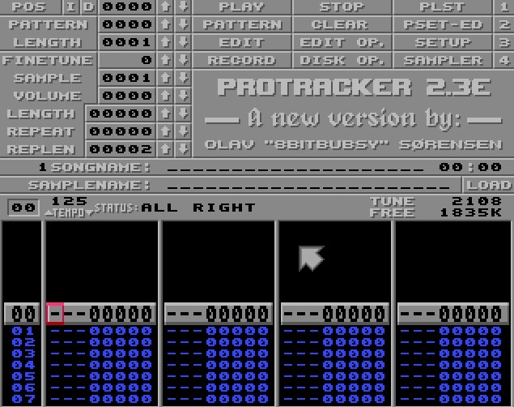
> Lots of musicians like Ugress that started on Amiga trackers and later became iconic artists.

But ProTracker was taking more and more off the Amiga scene and many modules didn't sound quite right with NoiseTracker.

I tried to implement the ProTracker player but I ran into serious issues with the E instruction which in NoiseTracker was quite simple but in ProTracker could do weird things.

There was especially one effect where I just couldn't understand the code.

In the end I gave up and pt_src3.s contains a slightly patched ProTracker player plus my Paula emulator.

The ProTracker code wasn't very fast but I accepted that compared to the Paula emulator the time it took wasn't very relevant.

## The Gurgelkvack "convent" 1992

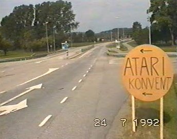
> We later learnt that "convent" in English didn't mean what we thought it did.

Summer 1992 Impulse arranged the first Impulse demo party. We had great ambitions and even booked a live-band, Akmepop, but not many turned up to our party.

Still we had lots of fun and very little sleep so in the end I think we all thought it was a success and we got to know [NoCrew](https://demozoo.org/groups/2220/) that was a bunch of nice guys that helped us organize Motorola Inside'93.

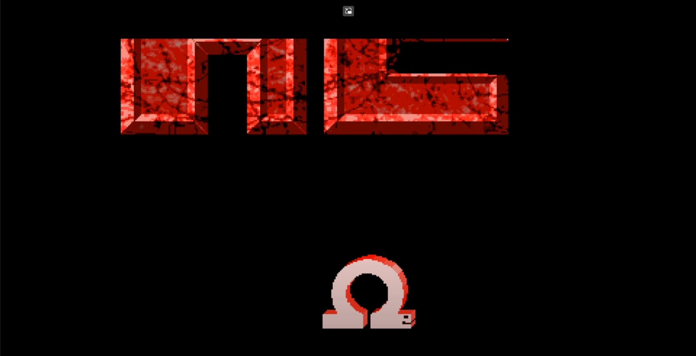
> [Omega Snake](https://www.youtube.com/watch?v=VvsqAyt2QFc) by NoCrew released at Gurgelkvack Convention 1992

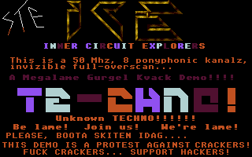
> Megalame Gurgel Kvack Demo by Inner Circuit Explorers released at Gurgelkvack Convention 1992

The pizza guy was less pleased as he had stocked up in anticipation of several hundred hungry nerds buying pizza.

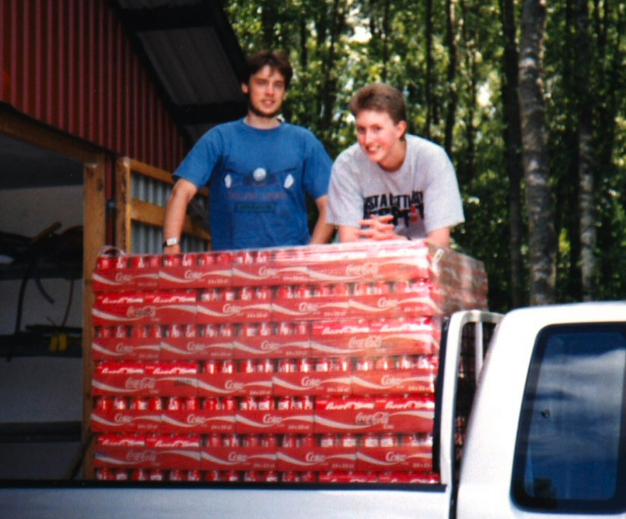
> Johan(Jez) and Reine(Longshot) stocking up on Coca-Cola. We had about 2,000 cans of Coca-Cola and sold maybe 50.


## Motorola Inside'93

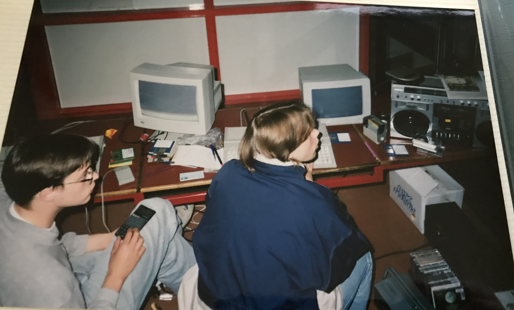
> Mårten (Lance) holding his beloved calculator, Johan (Jez) is playing some game.

Because Gurgelkvack'92 was fun we followed up next summer with Motorola Inside'93 that Impulse and [NoCrew](https://demozoo.org/groups/2220/) organized together.

Here [Excellence in Art](https://demozoo.org/sceners/2101/) released his [TalkTalk](https://demozoo.org/productions/59421/) demo which because I thought was outstanding not only because it used a version of my player, or that it was released at our lame party although it certainly helped.

I think [TalkTalk](https://demozoo.org/productions/59421/) has a cool and for its time ground-breaking design and is still enjoyable to watch. As a hacker very entrenched in writing optimised code and hardly being able to finish anything because of it this was an eye-opener for me.

Code doesn't matter, what matters is the impression you make and [TalkTalk](https://demozoo.org/productions/59421/) made a significant impression on me.

Another important event for me at Motorala Inside'93 was a chat with [Blade](https://demozoo.org/sceners/2500/) from [New Core](https://demozoo.org/groups/2218/) where we discussed STe players. [Blade](https://demozoo.org/sceners/2500/) later released [Octalyzer STe](https://demozoo.org/productions/73259/) so he is very knowledgeable.

The [Blade](https://demozoo.org/sceners/2500/) player was very performant and utilized an improved way to calculate volume. If I remember correctly at the time it looked a bit like this

```asm
move.b (a0)+,d0   ; Read channel #0, uses LCM1992 for volume control
move.b (a1)+,d1   ; Read channel #1
move.l d1,a5      ; Move d1 to a5 to read indirectly
add.b (a5),d0     ; Read volume corrected sample and mix with channel #0
move.b d0,(a4)+   ; Write left channel
move.b (a2)+,d0   ; Read channel #2, uses LCM1992 for volume control
move.b (a3)+,d2   ; Read channel #3
move.l d2,a5      ; Move d2 to a5 to read indirectly
add.b (a5),d0     ; Read volume corrected sample and mix with channel #2
move.b d0,(a4)+   ; Write right channel
```

The [Blade](https://demozoo.org/sceners/2500/) player of course relied on self-generating code and as a preprocess step it wrote the post-increments from a frequency table into the code so the input samples were stepped correctly.

The code takes about 45% CPU and the preprocess step took as far as I remember around ~10% so in total 55% CPU which was faster than my currently best player.

# A sleep deprived induced epiphany

I left [Blade](https://demozoo.org/sceners/2500/) and walked to my place.

The [Blade](https://demozoo.org/sceners/2500/) player was good, perhaps too good. I didn't like it obviously as I had a hacker ego.

I was tired due to not sleeping, which is custom at demo parties.

My player had some advantages in that it would optimise sample reads but it was slow on mixing. The [Blade](https://demozoo.org/sceners/2500/) player that mixed all channels at once could avoid reads and writes that way.

I was thinking to myself that even if I incorporated the improved volume calculation my player might be faster for certain songs but not overall.

*I needed something new.*

At that moment the entire design for pt_src3.s came to me. I knew how I would eliminate a lot of waste and the result would combine the benefit of my player with the benefit of the [Blade](https://demozoo.org/sceners/2500/) player.

The code would be much more complicated than any of my previous players and consume a lot of memory but it was doable.

I just had one big problem that I was unsure if it even had a solution.

# The creation of pt_src3.s

The key improvement of pt_src3.s over my old players is that instead of taking 1 channel at a time pt_src3.s takes 2 channels at a time.

That eliminates the need to read the sample from the output buffer and mix it again.

It does complicate things though and I had split into even smaller subframes to not run out of memory.

Each subframe is now 40 bytes and for each channel the player stepped between 3 to 26 bytes so it needs 23 combinations per channel that is 23*23 = 529 methods.

Then depending on the channel pitch the player pick the correct combination and mix two channels at the same time. The player handles fractional steps by switching between different combinations per subframe.

This means the resulting code looks something like this in the case we are going to repeat each sample 3 times.

```asm
move.b  (a0)+, d0   ; Read channel #0
move.b  (a1)+, d1   ; Read channel #1
move.l  d1, a3      ; Blade's improved volume calculation
add.b   (a3), d0    ; Mix channels
move.b  d0, $0(a2)  ; Write sample
move.b  d0, $2(a2)  ; Write sample
move.b  d0, $4(a2)  ; Write sample
```

But the player also optimised reads when the channels went at a difference pace.

Let's assume channel #0 repeat each sample twiche and channel #1 repeats each sample 10 times.

```asm
move.b  (a0)+, d0   ; Read channel #0
move.b  (a1)+, d1   ; Read channel #1
move.l  d1, a3      ; Blade's improved volume calculation
move.b  (a3), d1    ; Read volume corrected sample
add.b   d1, d0      ; Mix channels
move.b  d0, $0(a2)  ; Write sample
move.b  d1, $2(a2)  ; Write sample

move.b  (a0)+, d0   ; Read channel #0
                    ; d1 already contains the correct sample
add.b   d1, d0      ; Mix channels
move.b  d0, $0(a2)  ; Write sample
move.b  d1, $2(a2)  ; Write sample
```

That way the player ended up reading close to optimally.

The code got a lot more complex but the performance started to look real good.

But I still hadn't solved a big problem.

## Reading the manual out of desperation

The problem was writing the samples was slower than the Blade player. The Blade player could utilise post increment of the address register when writing the samples which gave a free increment.

I had to use indexed writes which was 4 cycles slower and took more memory.

4 cycles don't sound too bad but since the player had to write 100,000 samples each second those 4 cycles was 5% lost CPU time.

Very annoying.

So I read the 68000 manual in some vain hope there was some hidden address mode I didn't know about that could help me.

I guess I got lucky because I found a gem.

Up to this point I think my players didn't feature anything unique. They were ok and pt_src3.s would be good but thanks to combining a bunch of ideas into one complicated mess.

However, what I found I think is a trick seldomly used and I certainly hadn't seen it before.

The problem was this.

I wrote the left and right channel separately. Because the channels were interleaved I needed to write a byte and increment by 2.

If I did `move.b d0,(a0)+` a0 is only incremented by 1. Not good.

If I did `move.w d0,(a0)+` a0 is incremented by two but it only works for the right channel as it overwrites the higher byte and in addition if a0 is an odd address the 68000 throws an exception.

So I did `move d0,$0(a0)` and used self-generating code to generate increments by 2 but this took 4 cycles extra and took more memory.

What I found was a peculiar property of the stack pointer. In order to protect the stack pointer from ending up pointing to an odd address which would crash if you tried to push a 16bit or 32bit word if you did `move.b d0,(sp)+` the stack pointer was actually incremented by 2!

What I didn't know was what happened if the stack pointer was an odd address already, would it increment by 1 or 2?

It turned out it incremented by 2 regardless if the stack pointer had an even or odd address which is _exactly_ what I needed.

Now the code became something like this:

```asm
move.b  (a0)+, d0   ; Read channel #0
move.b  (a1)+, d1   ; Read channel #1
move.l  d1, a3      ; Blade's improved volume calculation
add.b   (a3), d0    ; Mix channels
move.b  d0, (sp)+   ; Write sample
move.b  d0, (sp)+   ; Write sample
move.b  d0, (sp)+   ; Write sample
```

Most of the player code needs to run into the 68000 supervisor mode in order to access the sound chip hardware. Putting the supervisor stack pointer to an odd address is not the best in case there's an interrupt and the 68000 tries to write return addresses to the stack. That will crash.

That's why pt_src3.s very randomly switches to user mode in the middle of it all. The usermode stack pointer can "safely" point to an odd address. To switch back to supervisor mode the trap #0 vector is set up to point to the continuation.

## Wrapping up pt_src3.s and my "career" as an Atari hacker

It took a significant amount of time to complete pt_src3.s but I got it done right before I started university. I was very happy with the performance and felt the sound quality was decent. The performance did fluctuate wildly which is a problem but I had some ideas on how to even it out somewhat.

However, I felt that university would require a significant amount of focus on my part and at the same time the Atari scene felt like it was fading away.

At university I was exposed to email and ftp for the first time so I uploaded pt_src3.s to a bunch of sites and signed off.

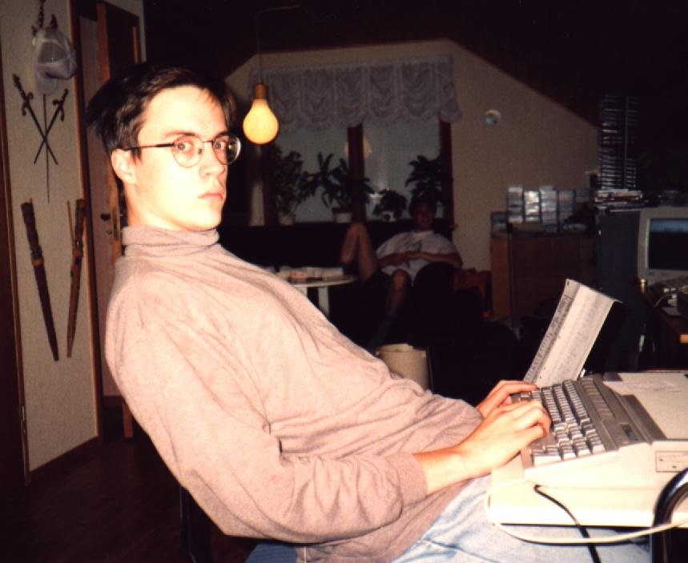

Lance / Mårten Rånge - 1990 to 1993/08/22

## Post Scriptum: Legacy

After I realised that the Atari ST community still lives on and that to my surprise the pt_src3.s is sometimes used I have wanted to write this story. I had many false starts but this time at least I wrote _something_ although my story telling is far from perfect.

I hope the story was appealing to someone out there.

When writing the story I find it interesting that I still remember clearly the assembler code. I don't remember what I did last week at work, what I remember are old listings I never shared and 68k instruction timings.

I remember meeting and talking to other young nerds about assembler code although I don't always remember the names so if you feel left out I didn't mean to, feel free to post a PR with an update.

One thing that truly blew my mind was when I read a blog post on by Paulo Simoes where he reversed engineered everything there is about pt_src3.s and improved upon it significantly. The original pt_src3.s wasn't commented (why? assembler is so obvious amirite?) and it relies on a bunch of tricks and self generating code. I was very impressed and I read the blog post with much joy. As an extra cherry on the top he [released a 12.5kHZ and 25kHz version](https://www.atari-forum.com/viewtopic.php?t=24718) of the player. I know how obscure pt_src3.s is so I am very impressed by this feat.

Or this by [Mrs Beanbag/RiFT](https://github.com/robcowell/LanceReplay) where she fixes some bugs in pt_src3.s. I am amazed that the Atari ST scene 2022 seems more alive than it did in 1993.

Let's not forget about the amazing new productions like [FirST Love by Overlanders](https://www.youtube.com/watch?v=3QginSr9V7A) that to a hacker whose mind is stuck in 1993 seems impossible. The Atari ST also [sounds amazing](https://www.youtube.com/watch?v=TeCystriENs) these days in ways I never thought was possible.

Honestly, the list of amazing things done the last 20 years on Atari ST is too long for me to list here.

### What about Impulse?

We still have internals occasionally. We don't really produce demos but we are having a good time.


> Visiting Mandus (Glimglam) on the left, Mårten (Lance) in the middle still having a bad hair day and Reine (Longshot) doing the mandatory V-sign.

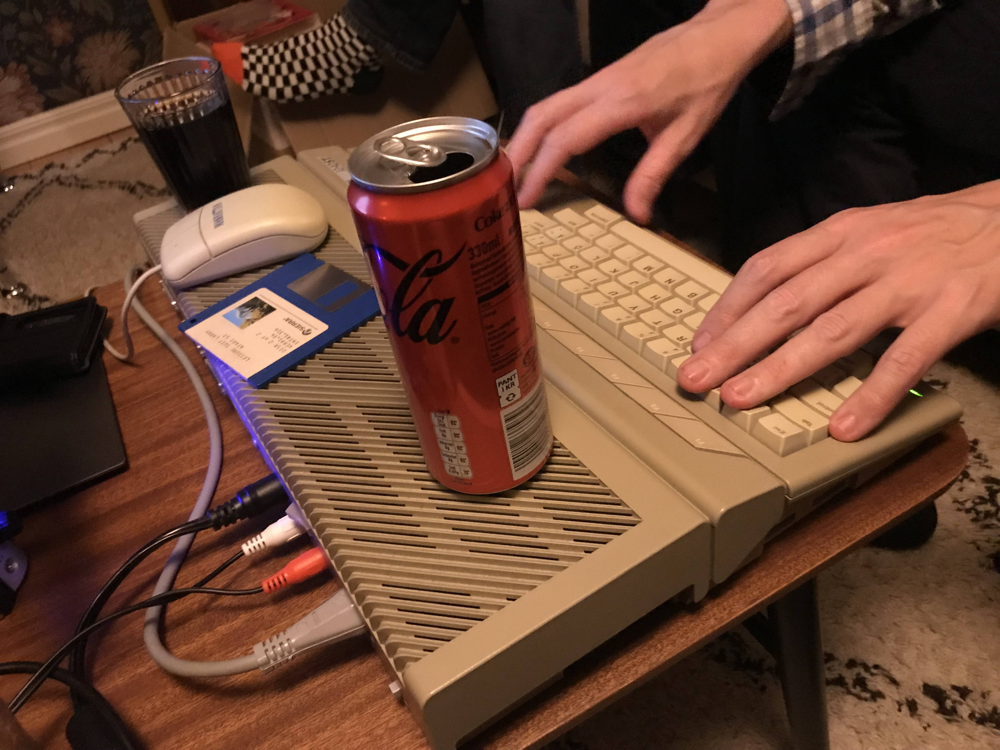
> Mårten (Lance) risks it all for a Coke Zero placed on a vintage Atari STe.

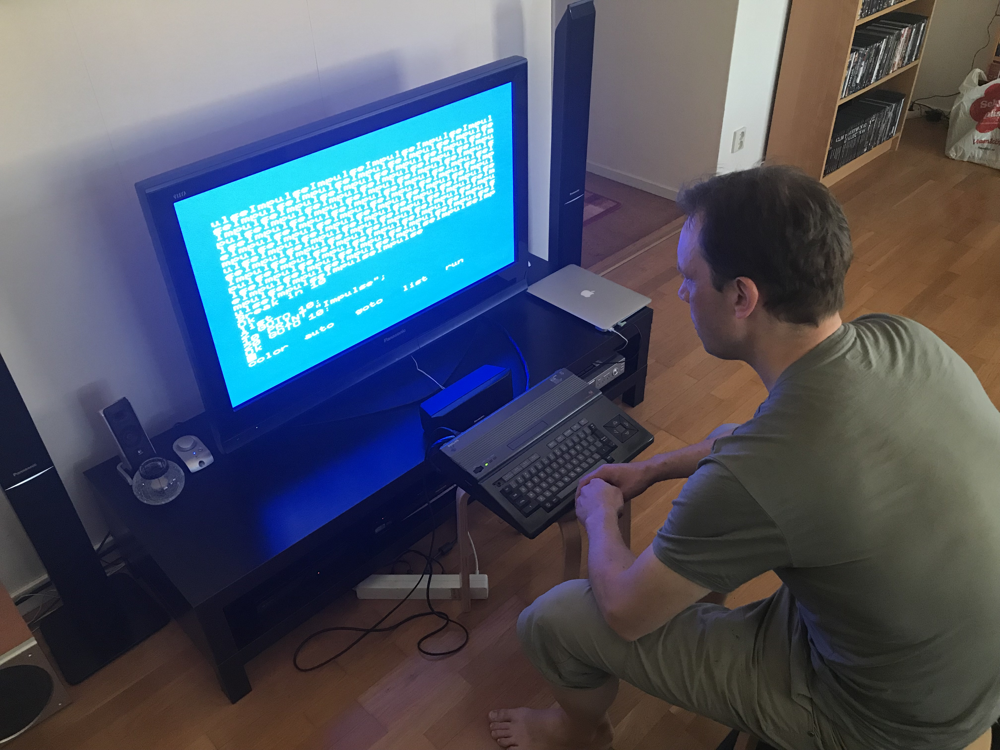
> Johan (Jez) working on his come back demo

## Post Scriptum: My Monochrome screen

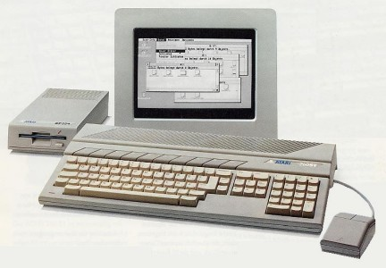

One of the reasons I got into mod players likes pt_src3.s was that I had inherited a monochrome paper white high resolution (640x400) screen from my dad. He had realized PC is the future and got himself a Toshiba laptop with Windows 1.0 and EGA graphics.

I didn't really have access to a TV and I gotten used to the super crisp (relatively) 71 hz paper white screen so it was hard for me to do graphics code.

Mod players is perfectly fine to develop on a monochrome screen although the speaker was kind of rubbish.

I did tinker a bit with 3D graphics but nothing serious came out of it and if I am being honest pt_src3.s was the only significant piece of work I finished on Atari STe.

## Post Scriptum: 50 kHz Octalyzer plugin

I had various discussions with [Blade](https://demozoo.org/sceners/2500/) regarding his [Octalyzer STe](https://demozoo.org/productions/73259/) project and he said he made a mod player interface called UCDM UMP.

It was reasonably straightforward to implement the 4 channel UMP plugin but my calculations showed that a 50kHz 8 channel UMP plugin should be possible.

While the 8 channel UMP plugin was fiddly to get to work and took alot of memory the calculations held up and it was possible to run on a 8Mhz Atari STe.

The binaries are available on [github](https://github.com/ggnkua/Atari_ST_Sources/tree/master/ASM/Impulse/UCDM) but unfortunately I lost the source code. I am kicking myself over that.

Youtube has a few [videos](https://www.youtube.com/watch?v=pfMrvI2sg90&t=241s) featuring the old Lance UCDM plugin.

## Post Scriptum: Solving the spikiness

One of the problems with pt_src3.s was the extreme spikiness of CPU usage. A demo coder kind of has to estimate the worst case and go with that even though the average might be much lower.

So I was playing with the idea to compute a few frames ahead and then, given a CPU budget per frame, interrupt the mod player when the budget is reached and continue the next frame. This should average out the spikiness but unfortunately I realised this quite late and it was tricky to implement so it remained just an idea.

## Post Scriptum: Fixing the bugs

As many have noted pt_src3.s had a fair amount of bugs, most of them I wasn't aware of.

One thing I was aware of however was that certain mods sounded quite bad. I believe it was usually a sample with a short loop that was close to a sine wave where it was most appearant.

I was hunting for this bug for a while but never managed to fix it. I am hopeful however when reading [Mrs Beanbag/RiFT](https://github.com/robcowell/LanceReplay) comments about fixed bugs in the sample loop code that the blemish is finally stamped out now. I also know Paulo Simoes fixed a bunch of issues as well. Thank you, it has been bugging me for 30 years.

## Post Scriptum: Amiga Octalyzer plugin

One of many plans I had was to port the pt_src3.s to Amiga hardware. I did some calculations and thanks to the Amiga having 4 channels with variable rate and volume control I think an Octalizer version would perform very well as well as sounding quite good.

I had some false starts but it's a significant amount of work and since I didn't have an Amiga I had to do all the testing on a friend's Amiga. Not the shortest inner loop for a developer. Code a few nights on the Atari. Take a copy, run over to my friend, test and crash. Back to the drawing board.

## Post Scriptum: My best hack

While thinking about my time as an Atari hacker I recalled the hack that I am most fond of. As mentioned, I talked to [Blade](https://demozoo.org/sceners/2500/) over making an UCDM plugin for pt_src3.s. As part of that process I got hold of the source to Blade's UCDM plugin. I remember the code was very clean and the idea was simple yet effective.

IIRC the core of the player looked like this

```asm
move.b (a0)+, d4  ; Load channel #0 sample into d4

move.b (a1)+, d1  ; Load channel #1 sample into d1
move.l d1, a4     ; Upper bits of channel d1 is address to volume table
add.b (a4), d4    ; Mix volume corrected channel #1 with channel #0

move.b d4, (a5)+  ; Write mixed value to output buffer

move.b (a2)+, d4  ; Load channel #2 sample into d4

move.b (a3)+, d3  ; Load channel #3 sample into d3
move.l d3, a4     ; Upper bits of channel d3 is address to volume table
add.b (a4), d4    ; Mix volume corrected channel #3 with channel #0

move.b d4, (a5)+  ; Write mixed value to output buffer
```

Blade player mixes all 4 channels at the same and uses LCM1992 to get correct volume for the channel #0 and channel #3. For 50kHz the core of the player consumes about 45% CPU which is very competitive.

I didn't really understand at first how the channels are resampled into the desired frequency.

Blade explained that he precomputed frequency tables that before he called the core mixer routine he had replaced `move.b (a0)+, d4` with `move.b (a0), d4` at the appropriate places so that the correct sample frequency was achieved. This takes a few cycles during each frame but not too bad.

What was a bit more concerning was the frequency tables consumed about 1MiB of memory. This could be mitigated by reducing the frequency resolution which sounded great for some mods but not others.

While converting pt_src3.s to UCDM I was thinking about this problem a bit and remembered an interesting and seldomly used feature of the Atari STe blitter.

The Atari STe blitter was pretty cool but in comparison to the Amiga blitter it was a bit lacking.

The Amiga blitter could read and mix 3 channels which was very useful when drawing sprites aka bobs on screen. Channel #0 reads sprite data, channel #1 reads sprite mask data, channel #2 reads the background image, AND away the background using the mask and OR the sprite data in its place then writes the data back to the background. The Atari STe blitter had only 2 input channels which meant drawing sprites required two passes, first AND background with mask, then OR sprite with background. In addition, the Amiga blitter could draw lines (!!) and fill polygons (!!). Very forward thinking.

However, the Atari STe had a feature not in the Amiga blitter. The blitter had 16 16bit registers in the blitter and 1 of the sources could use the lower 4 bits to lookup a value that is written to the output. Beat that Amiga!

I had attempted to make a blitter based polygon filler using blitter lookup but it was too hard for me.

When I thought about the frequency tables there is just 1 bit of information needed; increment the register or no? However, for performance reasons the Blade player stored a full 16bit word that could just be copied into the mixer code.

If you compacted the frequency tables into a single bit then you could reduce the memory overhead from 1MiB to 64KiB. Then you could populate the blitter lookup table with appropriate CPU instructions, set a frequency table as input source, bit shift the desired frequency bit to the lowest bit, use blitter lookup mode and blit into the mixer code.

I tried it and it seemed to work fine while reducing memory overhead from 1MiB (way too much) to 64KiB (ok!).

I remember this as the sweetest hack I ever did on the old Atari STe, unfortunately the source code is lost in time.

PS. My second sweetest hack was getting a sync lock using the `stop` instruction. I am not sure if it was a practical way to get sync lock but it worked on my machine (TM).

## Post Scriptum: How do you get started today?

One thing I wonder over sometimes is: "How do you get started today?"

I know why _I_ started and what motivated me but I have no clue what motivates kids today and what they find is challenging.

When I think back of us being 15 year old assembler hackers mostly self-taught I am amazed about how much potential a teenager has. Just add motivation and they can do amazing things.

I talked to a [very clever woman](https://www.linkedin.com/in/amanda-n/) when I worked at Ericsson that is about 20 years younger than me. She started programming because she played [The Sims](https://www.ea.com/games/the-sims) alot and she wanted her Sims to have purple eyes and custom clothes. She did so by tweaking scripts, images and xml files in the game's folder and found that it was fun and she ended up as a programmer.

So easy and yet so hard, just motivate the teenager and miracles will happen.

## Post Scriptum: Shaders

I don't write Atari ST code anymore and I personally don't feel that motivated to start again. I have the deepest respect for all the Atari sceners active today and am amazed at what is accomplished.

However, I have the demo itch in me and want to do demos still. What I found that scratches that itch is writing shader code for WebGL.

Using tools like [kodelife from hexler](https://hexler.net/kodelife) it is very interactive and fun to write shader code which I share on [shadertoy](https://www.shadertoy.com/user/mrange). I don't think I am amazing at shader code but it give me joy.

I even put a few [Impulse WebGL demos](http://mrange.github.io/) together.

## Post Scriptum: My Casio FX-730P is ALIVE

I dug out the old Casio FX-730P that was the start of it all and plugged some new batteries into it. It started flawlessly after 30 years of silence.

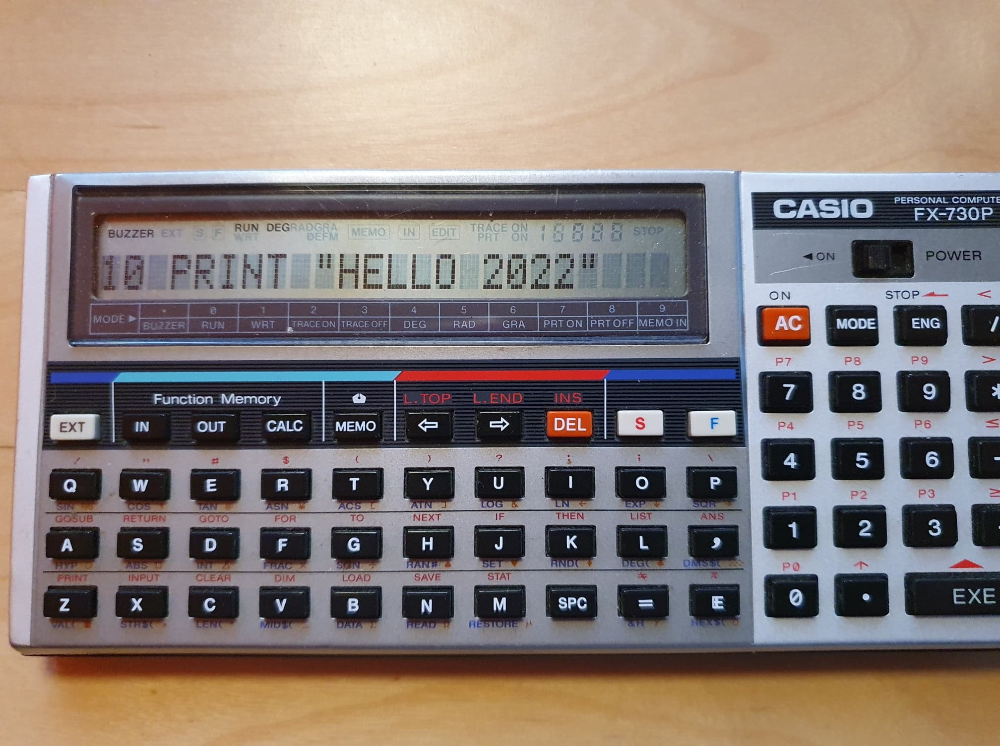

## Post Scriptum: Comments on this blog post.

I received comments and correction for this blog post. I have only included your first name and the first character of your last name as a precaution if you are not ok to appear in this blog post.

### Troed S of SYNC

Many thanks for a very enjoyable read! Love the fact you used the stack-increment trick - had no idea

I thought that trick was a newer discovery. I know I use it in the YM stream playback in Closure, but I didn't know about it back in the old days.
Btw, since you reference the sprite record and your idea about rendering sound a few frames ahead - yes - that's indeed one of the tricks used for such records where CPU usage varies. It was also why demos with large filled 3D cubes already back then had them bounce between small and large size

> Thank you very much for you comment Troed, I am glad you enjoyed the blog post and thanks for sharing some demo techniques.

### Daniel H

Awesome blog post! Thanks!

> My pleasure Daniel

### Wietze S

That was fun to read! This year I was looking into modplayers, and I indeed know your modplayer to be reknowned for its sound quality. However to use it in a demo, is... troublesome, because all in all, it takes a lot of CPU. I found that Paulo Simoes (whom you are referring to in your article I believe), reworked your code to provide a somewhat faster playback routine in 12.5, 25 and 50khz playback. I took on this code myself to clean our some of the static asm structures he put in, to make it useable for a demo (imo anyhow). It can be found [here](https://github.com/ggnkua/Atari_ST_Sources/tree/master/ASM/SMFX/Lance) ; just to let you know you effort are living on in 2022. Kind regards and kind appreciation from the bearers of current scene fire.

> Thank you Wietze for your kind comments and finding Paulo Simoes name for me. I couldn't remember but I have updated the blog post thanks to your info.

### Fredrik O

Your player is what inspired me to use the (sp)+ trick to write the color and luminance channels for the texture mapper in Wait.

> I am glad your found some inspiration from the player. It sounds very interesting Fredrik how you were able to use the (sp)+ trick for a texture mapper. I would be very interested to learn more about that.

### Frédéric S

It's remember to me Paulo Simões who made some [great stuff](https://www.atari-forum.com/viewtopic.php?t=24718) with this player routs there are a long time.

> Frédéric thanks alot for finding Paulo's post on Atari-Forum I will take a closer look to see if I can understand what he did.

### Rob C of RiFT

*she, not he - the fixes were implemented by the amazing Mrs Beanbag of RiFT. We appreciate the mention though. Greets from Bossman of RiFT

> Rob, thanks for the correction my bad. I have updated the blog post accordingly. Please extend my apologies to Mrs Beanbag.

### Benoit D of Overlanders

Thanks a lot for this write-up Mårten Rånge. I loved reading you. It illustrates perfectly how iterative the optimization’s process is, which corresponds to what we described in our FirST Love’s making-of (btw, thanks for the notice. We’re very honored). It’s also very impressive to see that your work has been carried on by others later on. Very well done.

### Jean-Sébastien G of Overlanders
I double that, thanks for the mention Mårten Rånge

> Thanks alot for your comments. Part of my motivation for writing the story is showing that a result seldomly springs out of singular mind in the most optimal shape. It's a long process that involves talking and being inspired by other people. Sometimes the process can feel long and difficult when you make little progress but the feeling when you finally break through makes up for it 10 times. I wanted with this blog post give a shout-out to the people that inspired me knowingly or unknowingly.

### Henning S, fellow Atarist at Schibsted

(Translated)

Thanks,   I don't check the feed that often but this was a goldmine. You are were into the details and was doing Atari for longer than me but I recognize alot of it. We even look a bit like eachother in one of the pictures, turtleneck and glasses.

> Thanks alot Henning. I suppose the picture in question is this:


### Mattias K, fellow 68K fantast (Amiga)

Lots of retro on my mind now listening to the latest @retrohouruk and just read great post from @range_marten about emulating the Amiga Paula chip with high fidelity on the Atari

> Thanks alot Mattias. Let's meet up next time I am in Gothenburg.

### Rolf M

Nice writeup, bringing back memories from a time long gone (although my period was a bit earlier and only in 8 bits...)

> Thank you Rolf, 16 bit is too easy, 8 bit computing is the real challenge amirite?

### George (GGN)
Hi there,

First off: many thanks for releasing the player source all these years ago, it was (and still is) a landmark in STe audio! I even used it in a [small production](https://www.pouet.net/prod.php?which=7872) back in 2000 or so .

I just wanted to give you a heads up since you linked my source repository in your readme.
pt_src3/README.md

I had your source code in a folder called "Lance!" but, from what I understand, by the time you already were a member of Impulse. So I thought I'd move the source to an "Impulse" folder instead: https://github.com/ggnkua/Atari_ST_Sources/tree/master/ASM/Impulse/UCDM
So, that's pretty much it. If you think I should move it back as it was, just let me know. I just acted on an impulse (har har) without asking you first.

Again, thanks much for the player and the writeup!

> George, thank you for your kind words. I have updated the link in the blog accordingly. I always appreciate a good pun. Keep up the good work, sir.

### Arnaud C (Leonard/Oxygene)

very nice article! always interesting to read about our passion. Btw pt_src3 mixing code is still a masterpiece today

> Thank you for your kind words. Reading your article on the [sprite records](http://leonard.oxg.free.fr/record16/record16.html) was the first time I thought "I should write about my player!". It took many false starts until I finally got something I could publish.

### Martin G in response to Georges K

Georges K - certainly a lot of mod players around 90/91 used ADDX - some with fractional (step) parts in the top 16bits like some of mine .. which I think was creative as you say in the sense that it helped reduce register usage - and around that era this sort of trick along with the SP interleaving gave the fastest results without needing generated code. Personally, I always felt that code generation compromised quality in the precision of the frequency conversion , which even from a starting point with good fixed point fractional stepping was “bad” because it was essentially point sampling.. and this type of sampling of the input gave the characteristic “tinnyness” that a lot of ST mod players suffered from. Later on, using linear filtering or other improvements to “resampling” resulted in much higher quality playback.

> Thanks for your insights Martin. I agree on sound quality. I always thought pt_src3.s as a decent compromise between speed and quality. There are certainly ways to improve quality but it's easy to run out of clock cycles on the old Atari STe. During my active time I thought [Songs of the Unexpected](https://www.youtube.com/watch?v=BGU7X5r2Vzg) had one of the best quality players on the STe. [Hifidelity Dreams](https://www.youtube.com/watch?v=ZYDQW7WbESs) also sound great and have the most amazing rasterbar idea I have ever seen. At university as I got access to more powerful computers I started tinkering with a player to support better resampling but I lost interest.

### Joanna E

Haha, what a lovely blogpost! That was before my time, so it is a very history lession :D

> Thank you Joanna, very nice to hear that someone that wasn't there and experienced the zeitgeist still can appreciate the blog post. I am curious to learn someday how you started programming.

### Paul W aka manofstick aka F# performance guru

My first machine was a c64 too; and played a lot of games, but typed in a lot of those DATA x, y, z lines from magazines I bought! I ordered, on tape, a 6510 assembler from somewhere in the UK (which to Australia probably all up would of been > month I'm guessing, probably a bank cheque mailed to them, who knows...) and then coded in assembly a bit, but didn't really have anyone else I knew who liked this kinda stuff so didn't get too far. (Smooth scrolling of a line of text through use of ROL is the only thing my memory seems to cling to!)

I then got an Amiga 1000 which I bought with my brother - not sure why he put in cash, he didn't have the bug, and I don't even recall him using it that much, but man I loved that thing. Once again mainly played games, but I do remember writing a (shit) terminal emulator that did "encryped" (it was just xor'd with a string, and then "kind of" uuencoded to map back to valid chars) text so that my friends and I could chat on BBSs without the sysop reading everything!! (The BBS we used had 4 lines; obviously pre internet!) - The sysop took to just hanging up out connections whenever we used my terminal emulator (proving that he was spying on everyone chats!!!) so it was pretty shorted lived existence, but memorable.

Ahh, history :-)

> Paul, thank you for your interesting story on how you got started with computers. I never got into BBS but some of my friends swear it was the good internet and what we have now is a never ending nightmare in comparison.

